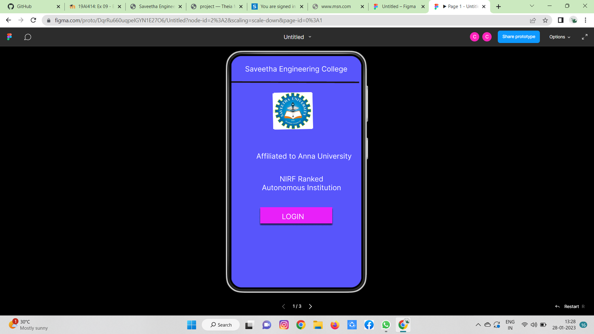
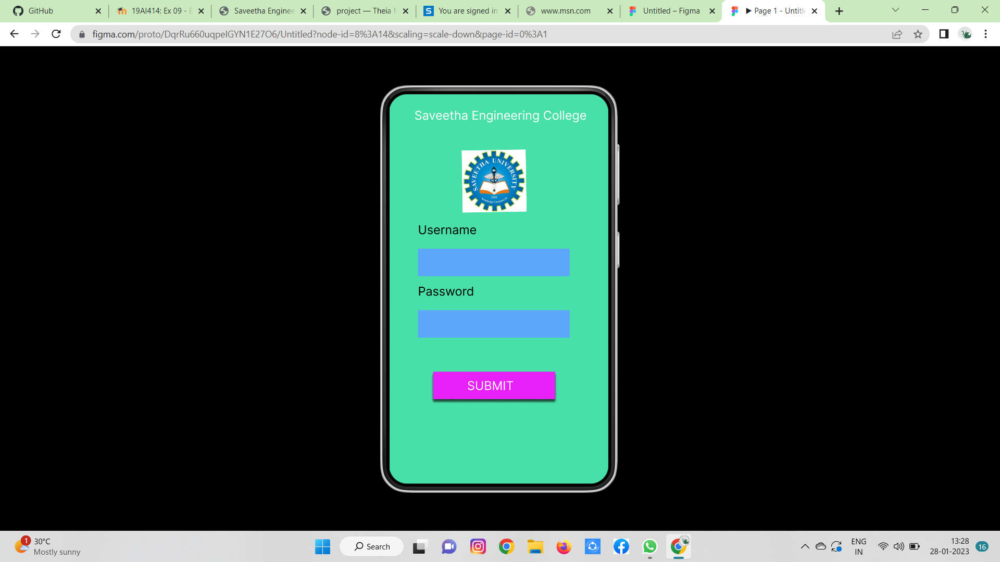
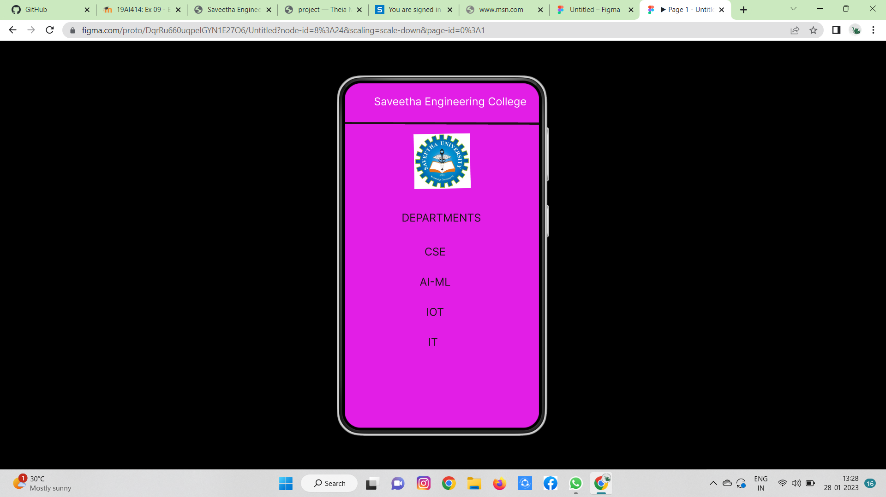

# Event Registration Web Application

## AIM:
To design, develop and deploy a web application for event registration.

## DESIGN STEPS:

### Step 1:
Create a new frame.

### Step 2:
Select any one preset size of your choice.

### Step 3:
Select the shapes you need.

### Step 4:
Import images as needed.

### Step 5:
Create pages based on your need and link them.

### Step 6:

Validate the HTML and CSS code.

### Step 6:

Publish the website in the given URL.

## DESIGN TOOL:
Figma

## code:


/* Home Page */

position: relative;
width: 360px;
height: 640px;
background: #5855FB;
box-shadow: 0px 4px 4px rgba(0, 0, 0, 0.25);

/* Saveetha Engineering College */

position: absolute;
width: 309px;
height: 38px;
left: 28px;
top: 23px;
font-family: 'Inter';
font-style: normal;
font-weight: 400;
font-size: 20px;
line-height: 24px;
text-align: center;
color: #FFFFFF;

/* logo */

position: absolute;
width: 105.28px;
height: 101.93px;
left: 118.56px;
top: 92.69px;
background: url(WhatsApp Image 2023-01-28 at 12.35.jpg);
transform: matrix(1, -0.02, 0.02, 1, 0, 0);
background: #5EA6FA;

/* Username */

position: absolute;
width: 128px;
height: 26px;
left: 47px;
top: 211px;
font-family: 'Inter';
font-style: normal;
font-weight: 400;
font-size: 20px;
line-height: 24px;

color: #000000;

/* Password */

position: absolute;
width: 128px;
height: 26px;
left: 47px;
top: 312px;
font-family: 'Inter';
font-style: normal;
font-weight: 400;
font-size: 20px;
line-height: 24px;
color: #000000;

/* Rectangle 2 */

position: absolute;
width: 200px;
height: 45px;
left: 72px;
top: 456px;
background: #E820F9;
box-shadow: 0px 4px 4px rgba(0, 0, 0, 0.25), 0px 4px 4px rgba(0, 0, 0, 0.25), 0px 4px 4px rgba(0, 0, 0, 0.25), 0px 4px 4px rgba(0, 0, 0, 0.25);

/* SUBMIT */

position: absolute;
width: 162px;
height: 24px;
left: 85px;
top: 467px;
font-family: 'Inter';
font-style: normal;
font-weight: 400;
font-size: 20px;
line-height: 24px;
text-align: center;
color: #FFFFFF;

/* Saveetha Engineering College */

position: absolute;
width: 310px;
height: 38px;
left: 40px;
top: 22px;
font-family: 'Inter';
font-style: normal;
font-weight: 400;
font-size: 20px;
line-height: 24px;
text-align: center;
color: #FFFFFF;

/* DEPARTMENTS */

position: absolute;
width: 271px;
height: 38px;
left: 43px;
top: 238px;
font-family: 'Inter';
font-style: normal;
font-weight: 400;
font-size: 20px;
line-height: 24px;
text-align: center;
color: #1A1515;

/* CSE */

position: absolute;
width: 278px;
height: 40px;
left: 28px;
top: 301px;
font-family: 'Inter';
font-style: normal;
font-weight: 400;
font-size: 20px;
line-height: 24px;
text-align: center;
color: #1A1515;

/* AI-ML */

position: absolute;
width: 278px;
height: 40px;
left: 28px;
top: 357px;
font-family: 'Inter';
font-style: normal;
font-weight: 400;
font-size: 20px;
line-height: 24px;
text-align: center;
color: #1A1515;

/* IOT */

position: absolute;
width: 278px;
height: 40px;
left: 28px;
top: 413px;
font-family: 'Inter';
font-style: normal;
font-weight: 400;
font-size: 20px;
line-height: 24px;
text-align: center;

color: #1A1515;

/* logo */

position: absolute;
width: 104.37px;
height: 101.93px;
left: 127px;
top: 94.69px;
background: url(WhatsApp Image 2023-01-28 at 12.35.jpg);
transform: rotate(-0.93deg);

/* IT */

position: absolute;
width: 278px;
height: 40px;
left: 24px;
top: 469px;
font-family: 'Inter';
font-style: normal;
font-weight: 400;
font-size: 20px;
line-height: 24px;
text-align: center;
color: #1A1515;

/* Line 3 */

position: absolute;
width: 360px;
height: 0px;
left: 0px;
top: 76px;
border: 4px solid #1C1313;
transform: rotate(0.16deg);
```
/* Rectangle 2 */

position: absolute;
width: 249px;
height: 45px;
left: 47px;
top: 254px;
background: #5EA6FA;

/* Rectangle 3 */

position: absolute;
width: 249px;
height: 45px;
left: 47px;
top: 355px;
```

## OUTPUT:




## RESULT:
The program to design, develop and deploy a web application for event registration is completed successfully.